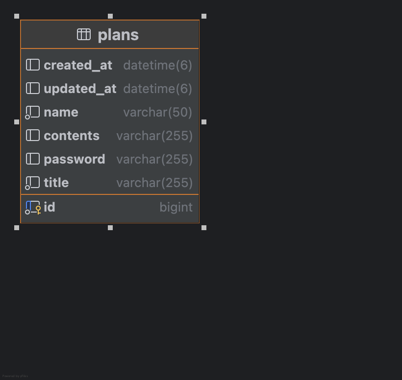

----

### 1. 3 Layer Architecture(Controller, Service, Repository)를 적절히 적용했는지 확인해 보고, 왜 이러한 구조가 필요한지 작성해 주세요.
   
### 🔍 내가 적용한 구조 점검
- Controller

HTTP 요청을 받고(GET /plans), name 파라미터를 전달해서 Service를 호출하고 응답을 반환한다.
비즈니스 로직(조회 조건 분기, 정렬, DTO 변환)은 하지 않는다.
- Service

조건부 조회(작성자명 유무)라는 비즈니스 규칙을 처리한다.
name 값에 따라 findAll() 또는 findByName()을 선택하고, 결과를 updatedAt desc로 정렬한 뒤 DTO로 변환한다.
@Transactional(readOnly = true)로 조회 전용 트랜잭션을 선언해 읽기 성능/의도를 명확히 했다.
- Repository

DB 접근만 담당한다.
기본 CRUD는 JpaRepository가 제공하므로 findAll() 등을 그대로 사용하고, 도메인 조건 조회(findByName)만 추가한다.

### 🔍 3 Layer Architecture 구조가 필요한 이유
- 관심사 분리:
HTTP 처리(Controller), 비즈니스 규칙(Service), DB 접근(Repository)을 분리하면 각 계층이 맡은 일만 하게 되어 코드가 깔끔해진다.

- 유지보수/확장성 향상: 
예를 들어 정렬 기준이 바뀌거나 조회 조건이 추가되더라도 Controller와 Repository에 불필요한 변경이 퍼지지 않는다.

- 테스트가 쉬워짐: 
Service 로직은 Controller 없이도 단위 테스트가 가능하고, Repository는 DB 접근만 검증하면 된다.

- 변경 영향 최소화:
DB 기술 변경이나 API 스펙 변경이 생겨도 계층 분리 덕분에 수정 범위를 줄일 수 있다.

### 2. @RequestParam, @PathVariable, @RequestBody가 각각 어떤 어노테이션인지, 어떤 특징을 갖고 있는지 작성해 주세요.

- @RequestParam: URL의 쿼리 스트링(Query String) 또는 폼 파라미터 값을 받는 어노테이션, 검색/필터/정렬 같은 옵션에 자주 사용, 
값이 없으면 null이 들어올 수 있어 null/blank 체크가 필요하다.
- @PathVariable: URL 경로(Path) 자체에 포함된 값을 변수로 받는 어노테이션, 리소스 식별자(id)에 사용, 
URL 구조만 봐도 어떤 자원을 다루는지 알 수 있다.
- @RequestBody: HTTP 요청 본문(body)의 JSON 등을 객체(DTO)로 변환해서 받는 어노테이션, POST/PUT/PATCH에서 사용(데이터 생성/수정)된다.
---
##  API 명세

### Base URL
- `http://localhost:8080`

###  📆 일정 생성
####  Request
- **Method**: `POST`
- **Endpoint**: `/plans`
- **Content-Type**: `application/json`

---

####  Response

##### ▶ 201 Created (생성 성공)
```json
  {
    "id": 4,
    "name": "이짹짹",
    "title": "일본여행",
    "contents": "삐약이랑 휴가",
    "createdAt": "2026-02-04T15:10:22",
    "updatedAt": "2026-02-04T15:10:22"
  }
```

#### ▶ 400 Bad Request (요청 오류) , 500 (서버 내부 오류)
```json
{
  "status": 400,
  "error": "Bad Request",
  "message": "이름은 필수 입력 값 입니다."
}
```
```json
{
  "status": 500,
  "error": "Internal Server Error",
  "message": "요청을 처리하는 중 서버에서 오류가 발생했습니다."
}
```

###  📆 전체 일정 조회
####  Request
- **Method**: `GET`
- **Endpoint**: `/plans`
- **Accept**: `application/json`

---

####  Response

##### ▶ 200 OK (성공)
```json
 [
  {
    "id": 1,
    "name": "김나비",
    "title": "미팅",
    "contents": "거래처 딩동댕이랑 미팅있음",
    "createdAt": "2026-02-04T14:32:18",
    "updatedAt": "2026-02-04T14:32:18"
  },
  {
    "id": 2,
    "name": "김야옹",
    "title": "계모임",
    "contents": "놀이동산 가기로 ㄱㄱ",
    "createdAt": "2026-02-04T15:10:22",
    "updatedAt": "2026-02-04T15:10:22"
  },
  {
    "id": 3,
    "name": "김멍멍",
    "title": "점심약속",
    "contents": "엄마랑 파스타 먹기로 함",
    "createdAt": "2026-02-04T16:01:45",
    "updatedAt": "2026-02-04T16:01:45"
  }
]
```

#### ▶ 500 Internal Server Error (서버 내부 오류)
```json
{
  "status": 500,
  "error": "Internal Server Error",
  "message": "요청을 처리하는 중 서버에서 오류가 발생했습니다."
}
```

###  📆 선택 일정 조회
####  Request
- **Method**: `GET`
- **Endpoint**: `/plans/{planId}`
- **Accept**: `application/json`

---

####  Response

##### ▶ 200 OK (성공)
```json
  {
    "id": 2,
    "name": "김야옹",
    "title": "계모임",
    "contents": "놀이동산 가기로 ㄱㄱ",
    "createdAt": "2026-02-04T15:10:22",
    "updatedAt": "2026-02-04T15:10:22"
  }
```

#### ▶ 500 Internal Server Error (서버 내부 오류), 404 Not Found (리소스 없음)
```json
{
  "status": 404,
  "error": "Not Found",
  "message": "해당 일정이 존재하지 않습니다."
}
```
```json
{
  "status": 500,
  "error": "Internal Server Error",
  "message": "요청을 처리하는 중 서버에서 오류가 발생했습니다."
}
```
###  📆 선택한 일정 수정 
####  Request
- **Method**: `PUT`
- **Endpoint**: `/plans/{planId}`
- **Content-Type**: `application/json`

---

####  Response

##### ▶ 200 OK (성공)
```json
 {
    "id": 2,
    "name": "황생선",
    "title": "계모임",
    "contents": "맛집투어 하기로 ㄱㄱ",
    "createdAt": "2026-02-04T15:10:22",
    "updatedAt": "2026-02-04T15:10:22"
  }
```

#### ▶ 400 Bad Request(요청 오류), 404 Not Found (데이터 없음), 500 Internal Server Error(서버 내부 오류)
```json
{
  "status": 400,
  "error": "Bad Request",
  "message": "이름은 필수 입력 값 입니다."
}
```
```json
{
  "status": 404,
  "error": "Not Found",
  "message": "해당 일정이 존재하지 않습니다."
}
```
```json
{
  "status": 500,
  "error": "Internal Server Error",
  "message": "요청을 처리하는 중 서버에서 오류가 발생했습니다."
}
```
###  📆 선택 일정 삭제
####  Request
- **Method**: `DELETE`
- **Endpoint**: `/plans/{planId}`
- **Content-Type**: `application/json`

---

####  Response

##### ▶ 204 No Content (삭제 성공)
```json

```

#### ▶ 404 Not Found (데이터 없음) , 500 Internal Server(서버 내부 오류)
```json
{
  "status": 404,
  "error": "Not Found",
  "message": "해당 일정이 존재하지 않습니다."
}
```
```json
{
  "status": 500,
  "error": "Internal Server Error",
  "message": "요청을 처리하는 중 서버에서 오류가 발생했습니다."
}
```